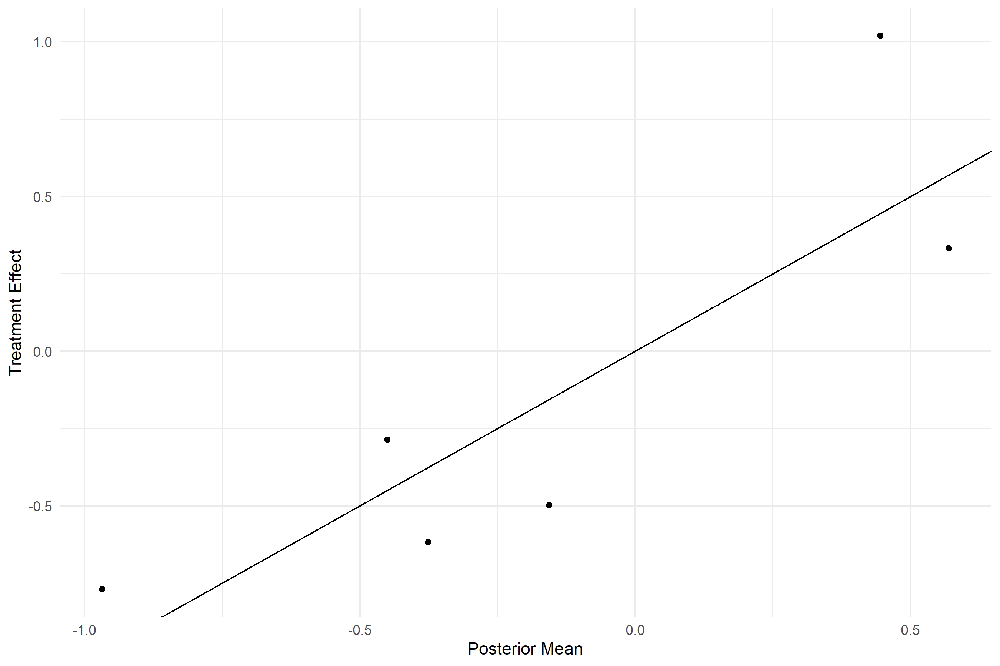
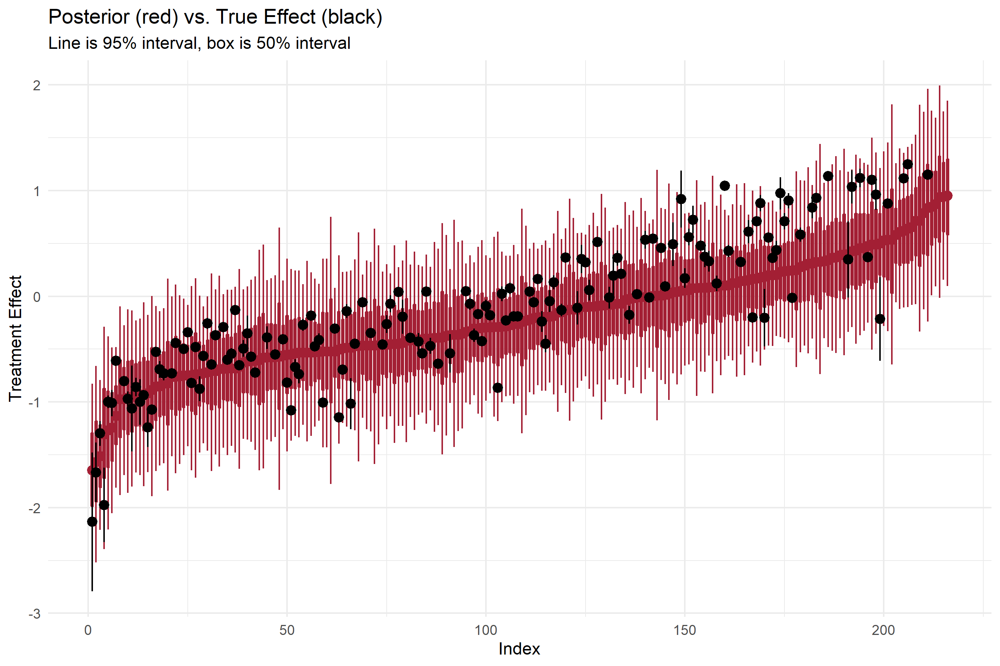
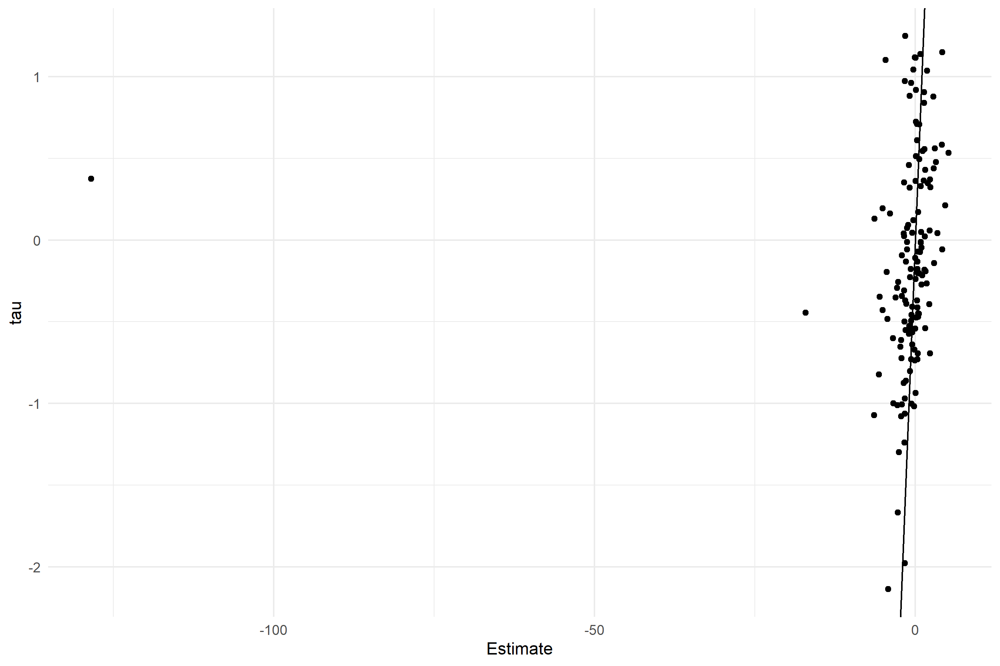
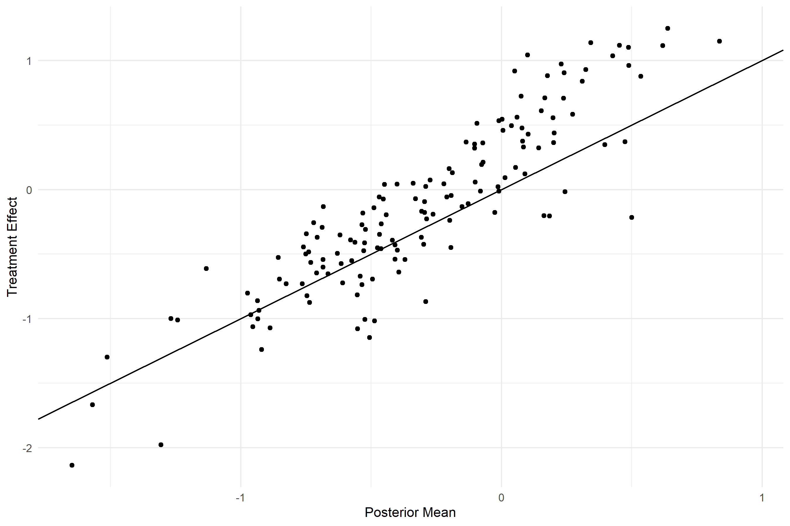

```{r setup, include=FALSE}
library(tufte)
# invalidate cache when the tufte version changes
knitr::opts_chunk$set(tidy = FALSE, cache.extra = packageVersion('tufte'))
options(htmltools.dir.version = FALSE)
```

# Abstract

Causal estimates are critical for understanding policy interventions, but without assuming that treatment effects are constant it is difficult to know how to extrapolate those estimates to new populations. This paper proposes a framework borrowed from the survey literature for directly measuring how treatment effects vary across the population and demonstrates how to use the model to extrapolate to new populations. 

# Introduction

Our hope as scientists and policy makers is to make inferences that generalize beyond the immediate scope of our experiments. Beyond simply the scientific enterprise, the ability to extrapolate from experiments to populations at large is key to effective policy decisions. However, the assumption that all people respond the same way to the same treatment is often implausible, and when we relax that assumption we are left with an estimate that is stubbornly tied to our specific sample.

One great advantage of modern measurement is that we have rich information about the different subjects in our studies. We can use that information to adjust our estimates for factors that we could not adequately randomize or to accommodate different baselines from which we are measuring treatment responses. However, we can do more than merely adjust estimates of the average; we can directly estimate how treatment effects vary across the population.

In this context, I propose a four-step plan for moving from LATE to Great (no acronym yet):

1. Bin
2. Model
3. Project
4. Maximize

First, we bin observations into groups, based on their observable characteristics. When variables are continuous, this involves discretizing the variable into bins. Second, we create a principled model that describes how the cells relate to one another. Third, we take our estimates from our first population and project them onto a new one based on known or expected weights for the new population. The fourth step, should we need it, uses the projections of the model in combination with a utility (or loss) function that represents policy trade-offs to maximize (minimize) expected utility (loss) for a new policy roll-out.

The major challenge of this approach is that it runs head-long into the curse of dimensionality. The modeler faces a trade-off between the number of parameters to estimate and the number of observations to collect. Given a fixed set of observations $N$, the number of sub-groups grows exponentially along each dimension measured, representing (at minimum) three parameters to be estimated per group: the baseline response, the treated response, and the variance. The key insight here is that we have information about how these parameters relate to one another, which allows us to effectively identify high-dimensional, non-linear interaction effects.

In this paper, we estimate a treatment effect given an experiment with non-compliance, presuming that the analyst does not know a priori that treatment effects are constant. The treatment effects, in this case, are a kind of latent response surface, varying across characteristics that are either observed or not, corresponding to the expected outcome for an individual receiving treatment. We will work with binary treatments and continuous outcomes in an instrumental-variables setting, though the results generalize easily to an experimental context with full compliance. [^2]

[^2]: It is less obvious how this would generalize to a regression discontinuity design or similar inference methods.

Given subjects indexed by $i$, a binary treatment $d \in \{0,1\}$, a continuous or binary instrumental variable $Z$, and an outcome $Y$, let $Y_i(1)$ denote the outcome for individual $i$ had they gotten the treatment and $Y_i(0)$ indicate the outcome had they not received the treatment. Then we define the treatment effect $\tau_i$ as

$$\tau_i = E(Y_i(1)) - E(Y_i(0)).$$

In general without full compliance, 

$$\tau_i \neq E(Y_i(1) - Y_i(0)).$$

In economics, we commonly expect this to be violated, as people making choices tend to choose things they believe will bring them outcomes that they prefer, inducing a strong correlation between outcomes and treated status. To solve this, we introduce an instrumental variable $Z$, such that $d$ is a non-trivial function of $Z$.

Following the standard literature, we use "compliers" to refer to those in the sample who would have taken the treatment, given a shock from $Z$, but would not have otherwise. This contrasts with "always-takers," who would take the treatment regardless of $Z$, and "never-takers," who can never be induced by $Z$ to take up treatment. We assume non-interference ($d_i$ depends on $z_i$ and not $z_{j \neq i}$), excludability (that outcomes do not depend on $z_i$ except via $d_i$, and monotonicity (an increase in $Z$ never leads to a _decrease_ in the probability of treatment uptake).

Furthermore, we presume that everything of interest has been measured and incorporated into the model. That is, given observable characteristics $X$, we expect treatment effects $\tau$ to be a function of $X$ and not variables we have not measured. 

In the machine learning literature, it is common to construct estimators that induce sparsity so as to remove variables that are not highly predictive. However, in this context, sparsity may not be desirable; simply setting the marginal movement of a bin around a central value to zero constructs a jagged set of point estimates, but we typically think of treatment effects as being smooth. In addition, we are often interested in uncertainty around treatment effects, and quantifying estimation uncertainty is non-trivial for penalized estimators. Finally, depending on the size of the grid, though we may not expect the marginal effect of a given bin to be large, we may expect them to be non-zero. It may actually be preferable to estimate a series of small, smoother changes across a large number of points in a grid rather than to construct a grid that is wider or smaller depending on point predictions.

We propose a different type of model that relates estimates across cells through a latent likelihood equation. In other words, given some grid-wise sampling density

$$Y_i \sim f(\tau_i, \theta),$$

We construct a model that describes the variation of the treatment effects

$$\tau_i \sim g(\theta),$$
and finally we put a prior on the hyper-parameters $\theta$ that penalize the complexity of the model to prevent overfitting. So, finally, 

$$\theta \sim \Pi(\theta).$$

This is commonly called a "multilevel" or "hierarchical" model, referring to its three-level structure, though it can be collapsed into a single likelihood. The structure itself is quite flexible, as the likelihood function $f$ can correspond to whatever the appropriate likelihood is for the observed data. Typically, $g$ is parameterized by a normal distribution, owing to the central limit theorem, with a mean linearized out and variation around that mean parameterized depending on the specific application.

The goal of $g$ and $\Pi$ in this structure is not to provide strong information about the specific realization we expect (say, incorporating information from a previous study about the treatment effect itself) but instead to describe a class of models that support the local regularities we believe structurally exist in the data-generating process. All the while, it would be unwarranted to construct $g$ in such as way as to make believable parameter values unlikely or rule out possibilities altogether. 

This model works so effectively because it no longer forces the various cells to be estimated independently of each other and, in the limit, can accommodate both complete dependence and complete independence between cell-wise means. As the number of parameters to be estimated approach or exceed the number of observations we have available, it can limit the search for the appropriate model to a reasonable class.

For continuous and ordinal variables, we treat the covariate lattice as a Gaussian Markov random field. In two dimensions, call $\theta_{i,j}$ a parameter in a cell along an even grid of binned covariates. Its neighbors are then $\Gamma = \{\theta_{i-1, j}$, $\theta_{i+1, j}$, $\theta_{i, j-1}\}$, and $\theta_{i, j+1}$. The simplifying assumption of a Gaussian Markov random field (relative to a general random field) is that all of the information relevant to estimating cell $\theta_{i,j}$ is incorporated in its neighboring estimates. In other words, for some parameter $P$,

$$P(\theta_{i,j} | \theta_{i,-j}; \theta_{-i,j}) = P(\theta_{i,j} | \Gamma).$$

We can then approximate this relationship with a linear basis function, sometimes called a conditional autoregressive process, where 

$$\theta_{i,j} \sim Normal(\alpha \Gamma, \Sigma),$$
though this is typically estimated via the precision matrix, $Q = \Sigma^{-1}$, for computational efficiency.

For unordered variables, we have no concept of "adjacency", so we propose a nested normal prior, where 

$$\theta_{i,j} \sim Normal(\theta, \sigma),$$

a common model in education research [@rubin1981estimation], meta-analysis [@meager2019understanding], and highly related models in political science [@ghitza2013deep].

While these parametric assumptions at first appear restrictive, they contain many important cases. For example, $\alpha = 0$ corresponds to complete independence between all cells and $\alpha = 1$ corresponds to constant treatment effects. For unordered variables, as $\sigma \to 0$, we end up with constant treatment effects; as $\sigma \to \infty$, we end up with cell-wise independent means, just as we would with stratified IV.

Using a model that fully describes the data-generating process also facilitates extrapolation not just of treatment effects but of any parameter of interest. For example, if we believed there to be heteroskedasticity, we could estimate the scale of the residuals as a function that varied along with characteristics. 

But more importantly, making our assumptions about the world explicit greatly simplifies the policy decision of the analyst, and what was previously an opaque set of judgments can now be discussed. If we estimate the model via a "fully Bayesian" approach, where we generate the full posterior distribution for all parameters, the projected version of those estimates represents the analyst's best guess at the state space in their new location. Presuming they have convex policy preferences that can be represented with some form of von Neumann-Morgenstern utility function, the optimal policy is simply the one that maximizes the expected utility of the policy rollout, which (given a utility function and a set of posterior draws) is trivial to estimate.

Perhaps the best argument for this model is its striking empirical performance, having a lower mean squared error and higher $R^2$ than 2-stage-least-squares estimation even in cases with few categories. The bias of the method reduces with finer grids without a comparable reduction in variance, generating good representations even when the number of cells exceeds the number of observations.

In addition to the paper, we have made estimation software available at [github.com/be-green/late-to-great/](github.com/be-green/late-to-great/), with efficient implementations of the models coded in Stan, a probabilistic programming language that facilitates maximum likelihood, fully Bayesian Markov chain Monte Carlo, and maximum a posteriori estimation via variational Bayesian methods [@carpenter2017stan].

# Background

There is a long history of instrumental variables being used to address a history of experimental and psuedo-experimental conditions without full compliance, dating back to @wright1928tariff, and growing immensely in popularity since @angrist1996identification. There is simply so much work evaluating and understanding instrumental variables approaches that we will limit this discussion to a specific context: We know that necessary assumptions are satisfied  (e.g. exclusion, monotonicity, etc.), and we are in the just-identified case with one instrument and one endogenous variable.

There is a substantial amount of recent work on extrapolating estimates from one population to a new population and analyzing to what extent local average treatment effects are portable. In the economics literature, there is a substantial amount of attention to estimating the extent to which a LATE approximates an ATE and identifying the extent to which researchers should be concerned with variation in treatment effects across different parts of the population. 

There are several papers in this vein that largely use the observable characteristics of the various sub-groups in the analysis: the always takers, never takers, and compliers. Perhaps most closely to this paper, @abadie2003semiparametric argues for using estimators that create an approximation to a full treatment effect function that varies with observable characteristics. @kowalski2016doing proposes extrapolating to new situations or programs by examining the marginal treatment effect, or the treatment effect for the person who is marginally entering treatment given an instrument. 

However, most of these papers are concerned with adjusting for differences between the population that takes up the treatment and the overall group (extrapolating the local average treatment effect to the average treatment effect). While the model presented in this paper can help address the same concerns as the previous literature, it can also be used to extrapolate effectively from one experimental context to a new, quite distant, population that might not have the same structure for take-up of the treatment at all.

The problem of projecting high-dimensional and non-linear interaction effects onto new populations is a long-standing problem in the survey literature, especially in political science. Researchers in that field are often interested in using polls from one state to forecast outcomes in a different state or the whole country [@wang2015forecasting] or to infer on sets of complicated interaction effects for different sub-populations [@ghitza2013deep]. Traditionally, the approach has been to take a non-representative polling population, divide those populations into several sub-categories, and re-weight the outcomes to reflect the new population total (going back at least as far as [@deming1940least]). 

However, this approach suffers from the curse of dimensionality: While it is desirable to have a finer grid along the characteristics you are estimating, the number of estimation cells grows geometrically with each additional characteristic you include. @gelman1997poststratification demonstrate the efficacy of multilevel regression modeling in capturing that variation, providing a structure that can allow for both complete independence between cells and constant responses across all cells along similar characteristics. There is a substantial amount of recent work on this problem, notably @gao2020improving, who incorporate structural information to the modeling of variation of responses along observed characteristics, and @kennedy2019know, who apply a similar approach to an experimental context.

Thus far, the approach in the causal inference literature to measuring conditional average treatment effects (separate treatment effects along some partition of the space of measured variables) has been focused on efficiently partitioning the space to capture the parts of the population that have substantially different treatment effects. With traditional estimators that forgo using any prior information about the structure of the model, this helps to balance between the expected variance of the estimator and how well approximated the treatment effect is by an average. Examples include an approach using a single tree to partition the covariate space [@athey2016recursive], and approaches using averages across lots of trees (average of effects across reasonable partitions) [@hill2011bayesian; @wager2018estimation].

In principle, the multilevel model proposed in this paper could be used to complement any method used to partition the covariate space. However, it is easiest to compare and simulate along an even grid of covariates, because in other cases it requires adjustments to the prior scale. However, the method is widely used in spatial statistics, even in settings with non-Euclidean distance metrics, by borrowing finite-element approximation techniques from the engineering literature [@lindgren2011explicit].


# The approach

Given observable characteristics about our population, we propose directly measuring how the local average treatment effects vary across those characteristics. This is to say, given a continuous covariate like income or age, the analyst would break that variable into a series of even bins, measuring a LATE for those who fall in that bucket. Discrete or ordinal variables are already in buckets, so they need no further preparation. Under normal assumptions, the LATE can only identify an effect for the population of "compliers," (that is, those who are moved into the treatment by the intervention) so this is the treatment effect we will estimate here. Thus, presuming that we have a treatment effect $\tau$ which is a smooth, integrable function of observable characteristics $X$

$$\tau = f(X),$$

we take some $\epsilon$ and calculate the average $\tau$ within that bucket using some standard method (for example, a randomized trial or instrumental variables). Presume that $X$ is a random variable with support over the region being sampled and density $g(x)$ over that region. Taking the one-dimensional case for now, as the number people in this region of the parameter space approaches $\infty$, 

$$\tau_\epsilon = \int_{x-\epsilon}^{x + \epsilon}f(x)g(x) dx.$$
In the limit, as $\epsilon \to 0$, $\tau_\epsilon \to \tau$. 

The treatment effect measured in that cell is an interaction effect, and we use the estimated mean to approximate the local behavior of the unobserved treatment effect function. This is essentially a "step-wise" approximation, with the level of each step being used to proxy for the local treatment effect of that subgroup (or, equivalently, the sum of the average treatment effect and the interaction term for the local subgroup and the treatment effect). However, this treatment effect function is a mapping from a possibly high-dimensional surface to some type of outcome variable. This makes traditional estimation approaches complicated, since we are always in a situation where the number of measurements of interest is large than the number of observations.

For example, suppose we measure a population of 10,000 individuals along a number of dimensions such as income, family size, and years of education. In a setting with a strong instrumental variable (where there is a well-measured, non-zero relationship between the instrument and the treatment uptake), we might be interested in understanding how treatment effects varied across all of those dimensions. There are two ways to tackle this problem in the economics literature: measure the interaction effects via linear regression or stratify people into subgroups and run 2-stage-least-squares by subgroup. 

With the first method, the interaction effect corresponds to the first-order Taylor expansion of the treatment effect function around the average level of the covariates of interest. Depending on the distribution of the covariates and the underlying function, this could be a highly effective strategy for estimating varying treatment effects. Even with only three covariates, if we wanted to include all of the interaction effects, we would run a regression with 10 control variables. This number grows combinatorically with each additional variable of interest. The subgroups of interest are often poorly identified, with some sub-categories having lots of observations and some having few. Furthermore, small errors in the slope estimate in the well-identified part of the population may create large errors in subpopulations far away from the mean. These difficulties are compounded if there are non-linear effects. In that case, the first-order approximation of the effect may be a bad one, especially in parts of the covariate space far away from the average. This problem is especially salient when trying to extrapolate to new populations, since the local approximation measured in the original population may center around a completely different part of the covariate space than the new population.

The second method is more similar to the approach we propose, but it runs head-long into the curse of dimensionality. The partition estimates a step-function approximation of the treatment effects, but depending on the variance of the treatment effect within that part of the partition, even a well-identified mean may be a poor approximation of the underlying function. However, we must trade off against the shrinking power of traditional estimators as the sample size grows smaller and smaller in each group.

Once again, taking the three covariates case, let us imagine that $\tau = \beta X^2$, where $X$ is a three-by-N matrix of covariates. Suppose that we observe covariates $X$, each uniformly distributed between -10 and 10, and have $N$ of 1000. Let us imagine e split groups into "high," "medium," and "low." We, again, are interested in all of the interaction effects. That gives us an average of 37 people in each sub-group! While that may give us enough power to detect a large effect, it becomes clear that adding even one or two more groups yields an unidentified model and potentially infinite variance of our estimator.

Presuming (perhaps incorrectly) that we are even comfortable with $E(N_j) \approx 37$ for group j, there is yet a further tradeoff. Suppose we knew the precise treatment effects in each subgroup. The mean squared error of using that mean as a point prediction over any interval $[a, b]$ in one dimension is given by 

$$\int_a^b \left(f(x) - \dfrac{1}{b-a} \int_a^b f(x) \right)^2 dx $$

So if $F(x) = \int f(x) dx$, this becomes

$$\begin{aligned}
MSE(\mu_j) &= \int_a^b \left(f(x) - \dfrac{F(b) - F(a)}{b-a}\right)^2 dx \\
&= \dfrac{F(x)}{3}\left(f(x) - \dfrac{F(b) - F(a)}{b-a}\right)^3 \Big|_a^b \\
&= \dfrac{F(b)}{3}\left(f(b) - \dfrac{F(b) - F(a)}{b-a}\right)^3 - \dfrac{F(a)}{3}\left(f(a) - \dfrac{F(b) - F(a)}{b-a}\right)^3
\end{aligned}$$

and in multiple dimensions we just expand the formula. In the case of $f(X) = X^2$, we can compute this value. Across one dimension of the "medium" bucket, if the treatment effect is given by the function $x^2$, the _known_ mean has a mean-squared-error of 7.2.

Suppose $b = c + \epsilon$, and $a = c - \epsilon$ for some $\epsilon > 0$. When choosing the number of subgroups to estimate, we are interested in choosing $\epsilon$ to minimize the variance of the estimator vs. the variance of mean as the approximation of the function. Fix c. Then the squared error of the approximation is given by 

$$\begin{aligned}
MSE(\mu_j(\epsilon)) = & \dfrac{F(c + \epsilon)}{3}\left(f(c + \epsilon) - \dfrac{F(c + \epsilon) - F(c - \epsilon)}{2\epsilon}\right)^3 \\ &- \dfrac{F(c - \epsilon)}{3}\left(f(c - \epsilon) - \dfrac{F(c + \epsilon) - F(c - \epsilon)}{2\epsilon}\right)^3
\end{aligned}$$

Clearly this shrinks with $\epsilon$, but on the other hand the variance of the estimator approaches $\infty$ given $N < \infty$ and $\epsilon \to 0$. The specific, optimal bins to pick will depend on the slope and curvature of the function. However, since the number of groups grows exponentially with dimension on an even grid, we consistently find ourselves on the edge of this trade-off. This is to say that if we expect any kind of variation in each direction of measurement, we hit the limits of our estimator before we have the approximation we want.

Next I will introduce an estimator which is well-identified, even in the case where we have more bins than observations, by incorporating known information about the treatment function. Suppose the treatment function is smooth. Then we have some information about the local behavior of the function; if two bins are adjacent, they are more likely to be close than if they had been farther away. We can encode this information with an intrinsic conditional autoregressive model, which incorporates the estimates around a given cell in the form of a prior distribution. 

We can represent a lattice as a series of neighbor relationships. Let each point in the center of a bin be a node on a graph or lattice. The clique is the set of adjacent points on the graph along each dimension. As a simplifying assumption, I am proposing to only include information about immediate neighbors.[^3] In other words for a set of parameters $\phi$ in cell $i$ (perhaps the baseline response and treatment effect) with neighboring cells $j$,

$$p(\phi_i | \phi_{j\neq i}, \phi_{-j}) = p(\phi_i | \phi_{j\neq i})$$

[^3]: the effectiveness of this assumption is likely application specific (e.g. to incorporate non-local information, it might be good to include more distant relationships through a Gaussian process prior, see, for example @banerjee2008gaussian). 

This models the process over which parameter values evolve along the covariate lattice as a Markov Random Field, meaning that it only depends on the states immediately proceeding this. These models have a substantial literature, dating back to @besag1974spatial, who motivates the approach for areal data as being equivalent to a global structure for the variation across a lattice via the Hammersley-Clifford theorem. Previous applications are most common in spatial models, where areal representations of distance encode neighbor relationships, and image processing, where pixels have a similar structure.

Owing to the central limit theorem, the conditional distribution is modeled as a Gaussian density, with 
$$p(\phi_i | \phi_{j\neq i}, \phi_{-j}) = N(\alpha \Sigma_{i\sim j} w_{i,j}\phi_j, q_i^{-1})$$

where $q^{-1}$ is the precision of the variance of cell $i$, $w_{i,j}$ represents the distance between $j$ and $i$, $i \sim j$ refers to the members of the clique of $i$'s neighbors, and $\alpha$ is the degree of spatial dependence. Because $\alpha$ is an estimated coefficient, these are often called "exact" CAR models.

A common variant, which allows for non-stationary variation around a central value, is called the Intrinsic Conditional Auto-Regressive Model (ICAR), where $\alpha$ is set to 1. Distance is arbitrary when working with scaled covariates on an evenly spaced lattice, and unobserved for ordinal covariates, so I make the simplifying assumption that the weights matrix is a set of binary indicators representing neighbor relationships. As a consequence of both of these assumptions, the expression becomes

$$p(\phi_i | \phi_{j\neq i}, \phi_{-j}, q_i^{-1}) = N(\dfrac{\Sigma_{i\sim j}\phi_i}{d_{i,i}}, \dfrac{1}{d_{i,i}q_i})$$
with the certainty about my prior guess on $\phi_i$ growing the more neighbor relationships I have, and the expectation being an average of the neighboring estimates. I chose to model the precision as a white noise process, with $q_i = 1$, which may or may not be appropriate depending on the application. However, when working with scaled outcome variables and not too many buckets, it helps to encode structural information we have about the treatment effects. In this case, it corresponds to the idea that without evidence we should view a movement away from the average of neighboring estimates to be within roughly one standard deviation of the outcome. When using too many buckets (e.g. a nearly continuous approximation) this type of prior may be too weak, and when using unscaled outcomes it may be too strong.

This prior is not, itself, a proper density, as it is invariant to any added constant. As a consequence, I estimate the mean of each parameter separately from the variation around it, and constrain variation around the mean to sum to zero. For details of the code and efficiently implementing this algorithm, refer to @morris2019bayesian.

This prior distribution acts as a way to augment the information available in each cell as the dimension of the aggregate estimate expands beyond what would otherwise be possible. It does so by providing a linear basis function that interpolates across cells with no information. To see this, consider a 1-dimensional example. The prior density of cell $i$ will simply be the average of the estimates of its neighbors, a set of lines drawn between both estimates which is weighted by the associated uncertainty on either side. This interpolation strategy is why this helps to include prior, structural information about the treatment effect being a smooth function.

The other advantage this approach is that it encodes the typical information structures used to model treatment effects as special cases. Should the information we observe push us away from a constant treatment effects assumption and towards infinite variance, we can recover the independent cell-wise model. On the other hand, if the constant treatment effects assumption proves to be correct, we can recover a model which pools the sample together. Since both are special cases, this prior information allows us (in a finite sample) to sit somewhere in the middle between completely un-pooled estimation and completely pooled estimation. The extent to which we share information across cells is driven by the model, which encodes structural ex-ante knowledge about the experiment.

As a consequence of this additional information, we can escape the potential trade-off between representing a high dimensional and non-linear function via a mean function and the infinite variance of the least squares estimator as the number of groups get large. When we are missing a group entirely, we interpolate between the surrounding cells, increasing the corresponding uncertainty about our parameter by $\dfrac{1}{d_i}$.

I put these GMRF priors on both the baseline response and the treatment effect, and weakly informative priors on other parameters in order to regularize the model estimates. For full details of the priors and estimation procedure refer to the appendix.

# Computational Evidence

To demonstrate the efficacy of the model relative to current approaches, I ran several hundred simulations from both linear and non-linear functions ranging from one to five dimensions. The model which uses the Gaussian Markov Random Field (GMRF) prior model on the structure of the covariates has indistinguishable bias and lower variance even in small dimensions and few groups. The advantage of the approach becomes clear as the number of groups and dimensions becomes large: often there are few observations in a group, and the variance of the least squares estimator grows vastly. By contrast, the GMRF model actually _improves_ in terms of mean-squared-error and $R^2$ as the number of groups gets large because it is able to incorporate information across cells being estimated. Importantly for policy, it is also able to interpolate for cells which see no data at all, using the neighboring cells to make predictions about the missing group.

The experiment constructs a random covariance matrix for the covariates, simulates 1,000 draws from that joint normal density, and models the treatment effects as a function of regression coefficients on those covariates. The $\beta$ values in the regression are draw randomly from a normal distribution. The treatment effect above the baseline is modeled as a function of $\beta f(X)$, where $f(X)$ is either linear, squared, or oscillating (sin) in all dimensions. This is to help understand the performance under different sorts of functions with different curvatures and degrees of non-linearity Additional results in the appendix also demonstrate the efficacy of handling a non-linear baseline response (outcomes without treatment) which are a function of the covariates, with comparable performance. These same treatment effects are then modeled with different numbers of split points for constructing the lattice.

Treatment uptake for the theoretical consumers is a function of their privately known true treatment effect. The top 10% of all outcomes are "always-takers" in all cases. Both models recover the LATE via 2-stage-least squares, with random assignment of treatment via a strong instrument. The difference between them is only the prior distribution on the cells in the second stage regression. Both identify the causal effect using first stage predictions and uncertainties from OLS. Both regular OLS and the Bayesian model have the same causal identification conditions, since they are both instrumental variables designs. To simplify this aspect of the simulations, I am using a strong, binary instrument, a binary treatment, and continuous outcomes. These could all be relaxed in principle; the simplicity of the design is meant to allow the performance of the two estimators under the high-dimensional conditions to shine through.

The Bayesian model is fitted in Stan, a probabilistic programming language designed to facilitate inference of custom models [@carpenter2017stan]. Stan is a flexible modeling language which leverages automatic differentiation and an adaptive variant of Hamiltonian Monte Carlo to efficiently sample from posterior distributions [@hoffman2014no].

For the purposes of comparing the two methods, I am using point predictions from OLS vs. the mean of the posterior of the Bayesian model fit. In all cases, I used 1,000 individuals who were drawn into the study.

```{r echo = F, message = F, warning = F, error = F, fig.height = 7, fig.width=9, dpi = 300}
library(data.table)
library(magrittr)
library(ggplot2)

modcomp <- fread("model-comparisons/model-summary-stats.csv")
modcomp %>% 
  ggplot(aes(x = ngroups, y = MSE, color = Model)) + geom_point() + 
  geom_smooth(se = F) + 
  facet_wrap(~k, scales = 'free_y', ncol = 1, 
             labeller = function(x) lapply(x, function(x) paste0(x, " Covariate(s)"))) +
  scale_y_log10(labels = scales::comma) + 
  ggtitle("Mean Squared Error of Predicted Treatment Effect vs. True Group LATE", 
          subtitle = "N = 1000, Treatment Effect Varies over Covariates") +
  xlab("Number of Groups per Covariate") +
  ylab("Mean Squared Error of Predicted LATE") +
  theme_minimal()
```


```{r echo = F, message = F, warning = F, error = F, fig.width=9, dpi = 300}
modcomp %>% 
  ggplot(aes(x = ngroups, y = R2, color = Model)) + geom_point() + 
  geom_smooth(se = F) + 
  facet_wrap(~k, scales = 'free_y', ncol = 1, 
             labeller = function(x) lapply(x, function(x) paste0(x, " Covariate(s)"))) +
  scale_y_continuous(labels = scales::percent) + 
  ggtitle("R2 of Predicted Treatment Effect vs. True Group LATE", 
          subtitle = "N = 1000, Treatment Effect Varies over Covariates") +
  xlab("Number of Groups per Covariate") +
  ylab("R2 of Predicted LATE") +
  theme_minimal()
```


```{r echo = F, message = F, warning = F, error = F, fig.width=9, dpi = 300}
modcomp %>% 
  ggplot(aes(x = ngroups, y = MSE, color = Model)) + geom_point() + 
  geom_smooth(se = F) + 
  facet_wrap(~k, scales = 'free_y', ncol = 1, 
             labeller = function(x) lapply(x, function(x) paste0(x, " Covariate(s)"))) +
  scale_y_log10(labels = scales::comma) + 
  ggtitle("Absolute Value of Bias of Predicted Treatment Effect vs. True Group LATE", 
          subtitle = "N = 1000, Treatment Effect Varies over Covariates") +
  xlab("Number of Groups per Covariate") +
  ylab("Absolute Value of Bias of Predicted LATE") +
  theme_minimal()
```

What immediately jumps out is how quickly OLS deteriorates in high dimensional settings! This should not be shocking at all, since the number of groups in the case of 5 covariates quickly exceeds the number of observations. Indeed, in many cases traditional OLS cannot even identify a treatment effect.

To better understand the performance of the GMRF model, I plot the mean square error and R2 of the point predictions, omitting the regular two-stage-least-squares, which degenerates too quickly to see.


```{r echo = F, message = F, warning = F, error = F, fig.height = 7, fig.width=9, dpi = 300}
modcomp[Model == "GMRF Prior"] %>% 
  ggplot(aes(x = ngroups, y = MSE)) + geom_point() + 
  geom_smooth(se = F) + 
  facet_wrap(~k, scales = 'free_y', ncol = 1, 
             labeller = function(x) lapply(x, function(x) paste0(x, " Covariate(s)"))) +
  scale_y_continuous(labels = scales::comma) + 
  ggtitle("Mean Squared Error of Predicted Treatment Effect vs. True Group LATE", 
          subtitle = "N = 1000, Treatment Effect Varies over Covariates") +
  xlab("Number of Groups per Covariate") +
  ylab("Mean Squared Error of Predicted LATE") +
  theme_minimal()
```

```{r echo = F, message = F, warning = F, error = F, fig.height = 7, fig.width=9, dpi = 300}
modcomp[Model == "GMRF Prior"] %>% 
  ggplot(aes(x = ngroups, y = R2, color = fun)) + geom_point() + 
  geom_smooth(se = F) + 
  facet_wrap(~k, scales = 'free_y', ncol = 1, 
             labeller = function(x) lapply(x, function(x) paste0(x, " Covariate(s)"))) +
  scale_y_continuous(labels = scales::comma) + 
  ggtitle("R2 of Predicted Treatment Effect vs. True Group LATE for GMRF Model", 
          subtitle = "N = 1000, Treatment Effect Varies over Covariates") +
  xlab("Number of Groups per Covariate") +
  ylab("R2 of Predicted LATE") +
  theme_minimal() + 
  labs(color = "")
```

In all cases the point predictions of the GMRF model actually gain in predictive power relative to the larger sample. This is because of the mechanical error associated with approximating a smooth function via a step-wise mean. As we get more bins, we get a better approximation of the underlying function, and because of our model structure our predictions do not completely degenerate. The largest reductions in the variance of the approximations are from the more curved functions, as we would expect.

Graphs I need to format still :

### 6 Groups, 1 dimension, tau = x^2


### 6 Groups, 1 dimension, tau = x^2, 2sls point predictions


### 6 Groups, 1 dimension, tau = x^2, GMRF point predictions


### 6 Groups, 3 dimension, tau = x^2


### 6 Groups, 3 dimension, tau = x^2, 2sls point predictions


### 6 Groups, 3 dimension, tau = x^2, GMRF point predictions



# Empirical Example: OHIE Experiment

- I have the model ready to roll
- Unfortunately, my computer is not big enough to estimate it (13k observations, 38k parameters...)
- Gonna borrow some server time when I get a chance
- Still, kind of amazing that 8 gb of ram is able to fit those models in like _max_ 30 min

# Extrapolating to new populations 

Given our new knowledge of the treatment effect in that cell, we can make project this local average treatment effect onto the new population by taking a weighted average of the cell-wise LATE estimates, where the weights are determined by the new population. In the survey literature this is known as _regression and post-stratification_, a model that is used to address non-representative responses in surveys, and (for instance) combine polls across states and forecast how a new state will respond (given state-level demographic information).

# Optimal Policy

I have stuff on this but I'm shy and not ready to share. If you got this far I really appreciate it.


